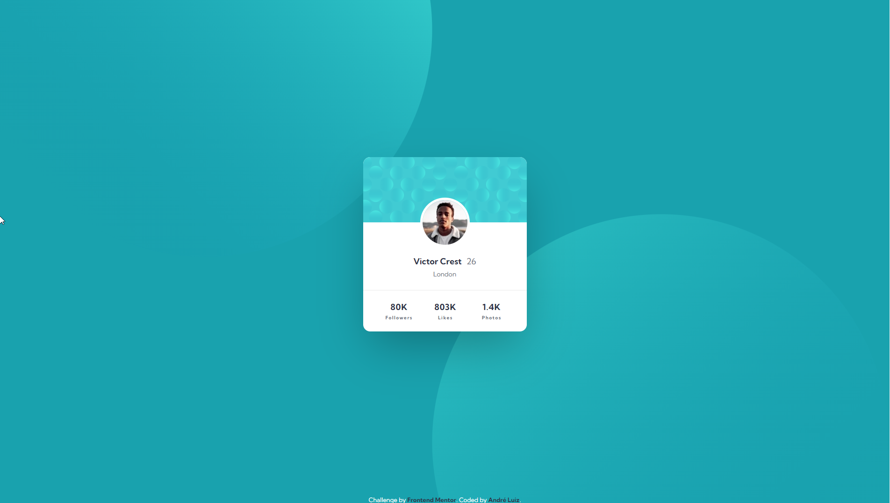
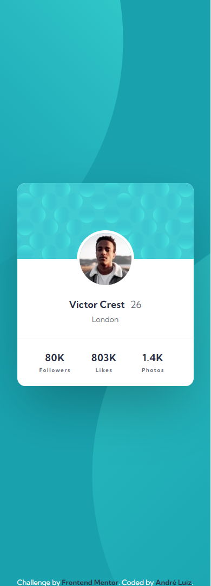

# Frontend Mentor - Product preview card component solution

Essa é a solução do desafio [Profile card component](https://www.frontendmentor.io/challenges/profile-card-component-cfArpWshJ) do Frontend Mentor. 

## Índice

- [Overview](#overview)
  - [O desafio](#o-desafio)
  - [Screenshots](#screenshots)
  - [Links](#links)
- [Meu processo](#meu-processo)
  - [Feito com](#feito-com)
  - [O que eu aprendi](#o-que-eu-aprendi)
  - [Continuação do meu desenvolvimento](#continuação-do-meu-desenvolvimento)
- [Autor](#autor)

## Overview

### O Desafio

Os usuários poderão:

- Ver o layout ideal dependendo do tamanho da tela do dispositivo;

### Screenshots
  Design Desktop:

Design Mobile:  
  

### Links

- Repositório: [GitHub](https://github.com/andre-pixioline/profile-card-component)
- Live Site URL: [GitHub Pages](https://andre-pixioline.github.io/profile-card-component/)

## Meu processo

### Feito com

- HTML5
- CSS 
- Flexbox
- Variáveis de root
- Layout Responsivo

### O que eu aprendi

Com esse desafio pratiquei a responsividade do site, fazendo uma versão para mobile, o uso do flex, variáveis, posicionamento de background usando 2 elementos e centralização dos elementos.

### Continuação do meu desenvolvimento

Vou continuar a estudar centralização, com o objetivo de fazer projetos cada vez mais complexos até a minha primeira vaga de desenvolvedor!

## Autor

- Frontend Mentor - [andre-pixioline](https://www.frontendmentor.io/profile/andre-pixioline)
- Instagram - [@andrepixioline](https://www.instagram.com/andrepixioline/)
- Linkedin - [André Luiz Pixioline](https://www.linkedin.com/in/andre-pixioline/)